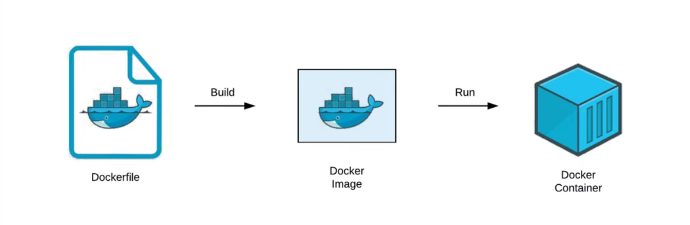

# Docker

[**Dockerfile**](Docker/Dockerfile%20254195f4e5048005a3bdc38363ff52d5.md)

[Manage Images](Docker/Manage%20Images%20254195f4e5048067acfcc5a2f17d3c4f.md)

[Manage Containers](Docker/Manage%20Containers%20254195f4e5048049ac69e0c2ede7ca26.md)

[Volumes](Docker/Volumes%20254195f4e5048091b403c2d79a7da285.md)

[Networking (need to learn)](Docker/Networking%20(need%20to%20learn)%20254195f4e504802baf58f1ae2933cbca.md)

[Get into the docker console](Docker/Get%20into%20the%20docker%20console%20260195f4e5048043bc4ded969a7b602e.md)

[Compose](Docker/Compose%202d7195f4e50480ed882adee3af3b13ea.md)