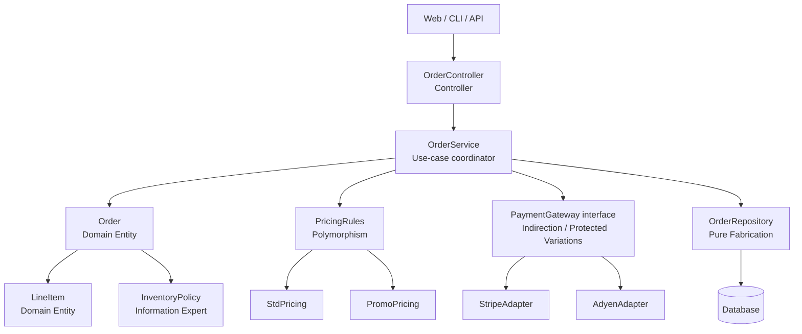

# GRASP

# **Creator**

- Definition: The class that owns/contains/aggregates something should create it.
- In the diagram: Order creates LineItem.
- Example: Order.AddItem() constructs LineItem so creation stays near ownership.

# **Information Expert**

- Definition: Put responsibility on the object with the data needed to do it.
- In the diagram: Order computes totals; InventoryPolicy checks stock rules using order data.
- Example: Order.Total() lives on Order, not on OrderController.

# **Controller**

- Definition: One object receives a system event and delegates work.
- In the diagram: OrderController handles “PlaceOrder”.
- Example: UI calls OrderController.PlaceOrder(); controller calls OrderService.

# **High Cohesion**

- Definition: Each class has one clear job.
- In the diagram: OrderService coordinates the use-case; Order holds order rules; PaymentGateway handles payment.
- Example: Controller does not calculate totals; domain does.

# **Low Coupling**

- Definition: Minimize how many things each class depends on.
- In the diagram: OrderService depends on PaymentGateway interface, not Stripe directly.
- Example: swapping Stripe→Adyen doesn’t change OrderService.

# **Indirection**

- Definition: Insert a middle layer to avoid direct dependency.
- In the diagram: PaymentGateway (interface) sits between app and payment provider.
- Example: OrderService calls PaymentGateway.Charge(); adapter translates to Stripe API.

# **Pure Fabrication**

- Definition: Invent a class not in the domain to keep design clean.
- In the diagram: OrderRepository is fabricated to isolate persistence.
- Example: Order doesn’t know SQL; OrderRepository.Save(order) does.

# **Protected Variations**

- Definition: Shield likely-to-change parts behind stable boundaries.
- In the diagram: payment providers are behind PaymentGateway.
- Example: provider API changes only touch StripeAdapter, not domain/app code.

# **Polymorphism**

- Definition: Replace big switch logic with type-specific behavior.
- In the diagram: PricingRules has StdPricing and PromoPricing.
- Example: PricingRules.Calculate(order) varies by implementation, not by if/else.

# **Low Cohesion**

- Definition: One class does too many unrelated things (a “god class”).
- In the diagram: what you avoid by NOT making OrderController do pricing + DB + payment.
- Example: if controller talks to DB + Stripe + pricing + order math, it’s low cohesion.