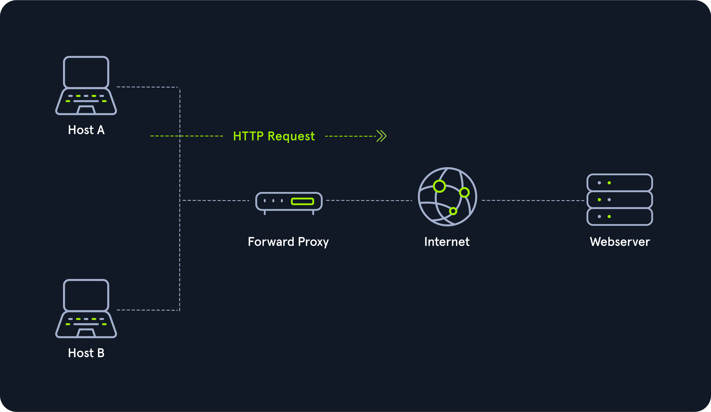

# Proxies

Many people have different opinions on what a proxy is:

- Security Professionals jump to `HTTP Proxies` (BurpSuite) or pivoting with a `SOCKS/SSH Proxy` (`Chisel`, `ptunnel`, `sshuttle`).
- Web Developers use proxies like Cloudflare or ModSecurity to block malicious traffic.
- Average people may think a proxy is used to obfuscate your location and access another country's Netflix catalog.
- Law Enforcement often attributes proxies to illegal activity.

Not all the above examples are correct. A proxy is when a device or service sits in the middle of a connection and acts as a mediator. The `mediator` is the critical piece of information because it means the device in the middle must be able to inspect the contents of the traffic. Without the
ability to be a `mediator`, the device is technically a `gateway`, not a proxy.

Back to the above question, the average person has a mistaken idea of what a proxy is as they are most likely using a VPN to obfuscate their location, which technically is not a proxy. Most people think whenever an IP Address changes, it is a proxy, and in most cases, it's probably 
best not to correct them as it is a common and harmless misconception. Correcting them could lead to a more extended conversation that trails into tabs vs. spaces, `emacs` vs. `vim`, or finding out they are a `nano` user.

If you have trouble remembering this, proxies will almost always operate at Layer 7 of the OSI Model. There are many types of proxy services, but the key ones are:

- `Dedicated Proxy` / `Forward Proxy`
- `Reverse Proxy`
- `Transparent Proxy`

---

## Dedicated Proxy / Forward Proxy

A forward proxy is a type of proxy service that sits in between a client and the internet, intercepting outgoing traffic from the client and forwarding it to the internet. The client is not aware of the forward proxy's existence, and the proxy can filter and modify the traffic as needed. Forward proxies are commonly used for web filtering, caching, and to provide anonymity.

### Forward Proxy

## Reverse Proxy

As you may have guessed, a `reverse proxy`, is the reverse of a `Forward Proxy`. Instead of being designed to filter outgoing requests, it filters incoming ones. The most common goal with a `Reverse Proxy`, is to listen on an address and forward it to a closed-off network. Many organizations use CloudFlare as they have a robust network that can withstand most DDOS Attacks. By using Cloudflare, organizations have a way to filter the amount (and type) of traffic that gets sent to their webservers.

### Reverse Proxy

## (Non-) Transparent Proxy

All these proxy services act either `transparently` or `non-transparently`.

With a `transparent proxy`, the client doesn't know about its existence. The transparent proxy intercepts the client's communication requests to the Internet and acts as a substitute 
instance. To the outside, the transparent proxy, like the non-transparent proxy, acts as a communication partner.

If it is a `non-transparent proxy`, we must be informed about its existence. For this purpose, we and the software we want to use are given a special proxy configuration that ensures that traffic to the Internet is first addressed to the proxy. If this configuration does not exist, we cannot communicate via the proxy. However, since the proxy usually provides the only communication path to other networks, communication to the Internet is generally cut off without a 
corresponding proxy configuration.