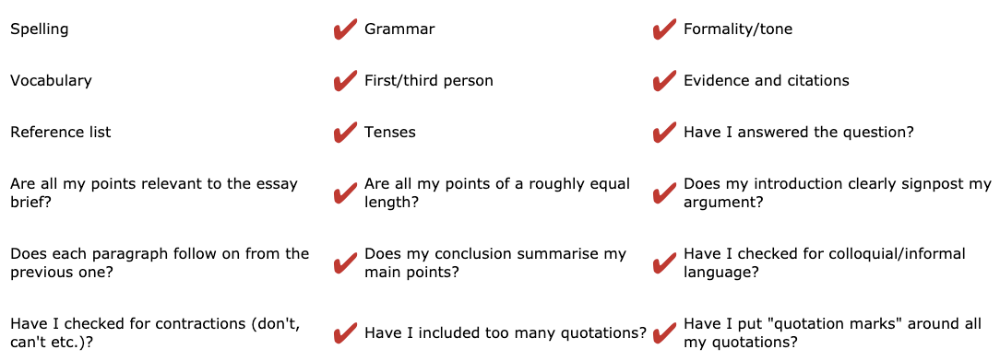

# Assignment

[Citing references: a guide to NTU Library Harvard style](https://now.ntu.ac.uk/d2l/lor/viewer/view.d2l?ou=52836&loIdentId=25435&contentTopicId=1019510)

*see link above for specific details on references*

*see link above for proof reading guide*

### [*!!!  IF STUCK ON ANYTHING WHEN IT COMES TO FORMATTING GO TO THE LIBRARY  !!!*](https://librarybookings.ntu.ac.uk/)

# Checklist

# Citation vs Reference

Citations - this is when you use some else's idea

Reference - this is when you create an accurate description of each element you have cited inline and at the end of your work

# How to reference

### E*xample:*

Essay extract:

It has been asserted that the Harvard referencing style is the most commonly used system, while still recognising that there are a variety of other styles available (Murray and Hughes 2008).

Reference list:

Murray, N. and Hughes, G., 2008. *Writing up your university assignments and research projects: a practical handbook.* Milton Keynes: Open University Press.

- Citations inline must include the name of the author `(nameHere year; secondName year)` or `nameHere (year)` or `nameHere(year, pageNum)`
- References at the end of the text must include, `theName, year. Name of book`
- References at the end must be in alphabetical order
- A bibliography is a reference list, however includes all sources you have looked at wether you have quoted them or not

### Try and make the citations flow in the text:

1. The work of Dow (1964), Musgrave (1968) and Hansen (1969) concluded...
2. It has been argued (Foster 1972) that the essential features of ...
3. This was further supported by results from a recent survey (see Meningitis
Research Foundation 2010).
4. Thornton and Brunton (2010) endorse the adoption of the Reggio approach in early
years educational settings in the UK.
5. Hampton (1970, p. 91) has described the relationship between local Members of
Parliament and the City Council as being in “a state of tension”.
6. ...Dow (1964a) and Dow (1964b) also provided evidence...

 *If quoting a two or three lines of text it is common to indent the quoted text and not bother with the quotation marks*

*if you add any text to a quote it should be said within square brackets*

### Reference examples at the bottom

1. Dow, D., 1964a. A history of the world. 3rd ed. London: Greenfield.
2. Dow, D., 1964b. Alternative history. London: Greenfield.

[Assignment research](Assignment/Assignment%20research%20dfd92b75e29e4a67a11f5c8d212fabc7.md)